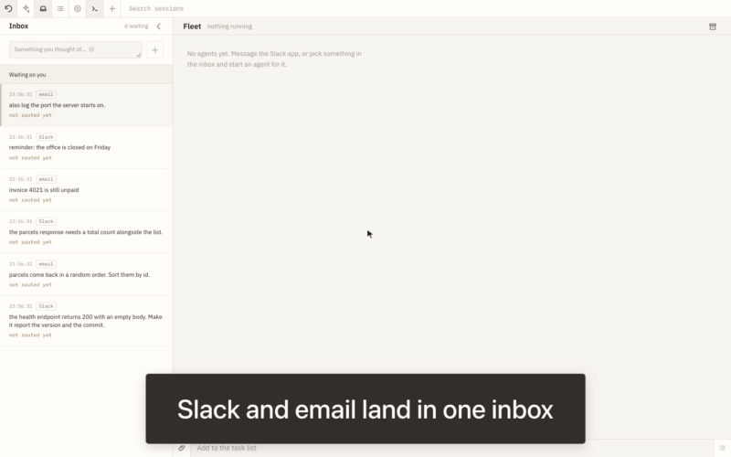

# oxroute

Everything asking for your attention in one inbox, sorted into agents that
do the work while you watch.

*[The video](demo/demo.mp4), recorded from the running app by
[demo/oxroute.oxd](demo/oxroute.oxd).*

| | |
|---|---|
| **Inbox** | Slack, email or anything that can POST waits in one place until you say where it goes |
| **Routing** | Send a request to a new session, to one already running, or throw it away |
| **Fleet** | Every session on one screen, with what it is doing now and what it just said |
| **Tasks** | A shared list the agents work through: they mark a task done, you approve it or send it back |
| **Corrections** | "Not yet" puts the task above the composer, so what is wrong is said with room and pictures |
| **Diagram** | Draw a change to the architecture diagram and the agent makes the code match it |
| **Drawing** | Mark up a screenshot and hand that to the agent, or file it as work |
| **Search** | Find the session by a line someone said in it, across oxroute's sessions and the harnesses' own |
| **Forks** | Branch a session into this card or one beside it, and merge it back when it is done |
| **Harnesses** | Claude Code and Codex, behind one interface |
| **Surfaces** | A web UI, a terminal UI and Slack, all on the same sessions |
| **Settings** | Light or dark, how much of each tool call you see, whether blocked work is drawn, keyboard hints |
